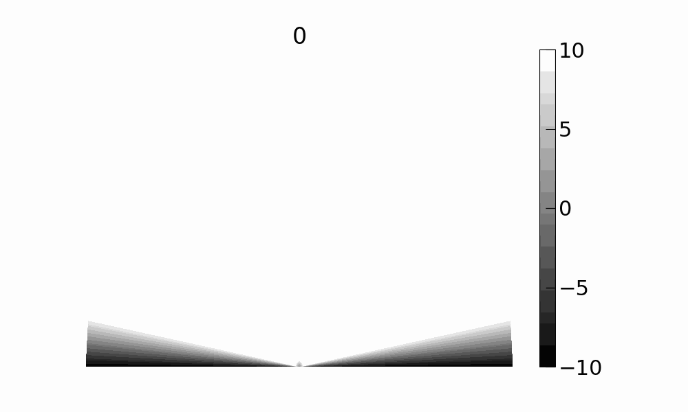

# Numerical Investigation of freezing of sessile water droplet 

This project investigates the freezing and subsequent singularity formation at the tip of the ice.

## References

1. [Conical shape of frozen water droplet](https://aapt.scitation.org/doi/10.1119/1.4897499)
2. [Review of experimental data](https://www.sciencedirect.com/science/article/abs/pii/S0378778820305089?via%3Dihub)
3. [Internal flow in freezing water droplets](https://link.springer.com/article/10.1007/s00348-019-2823-1)

